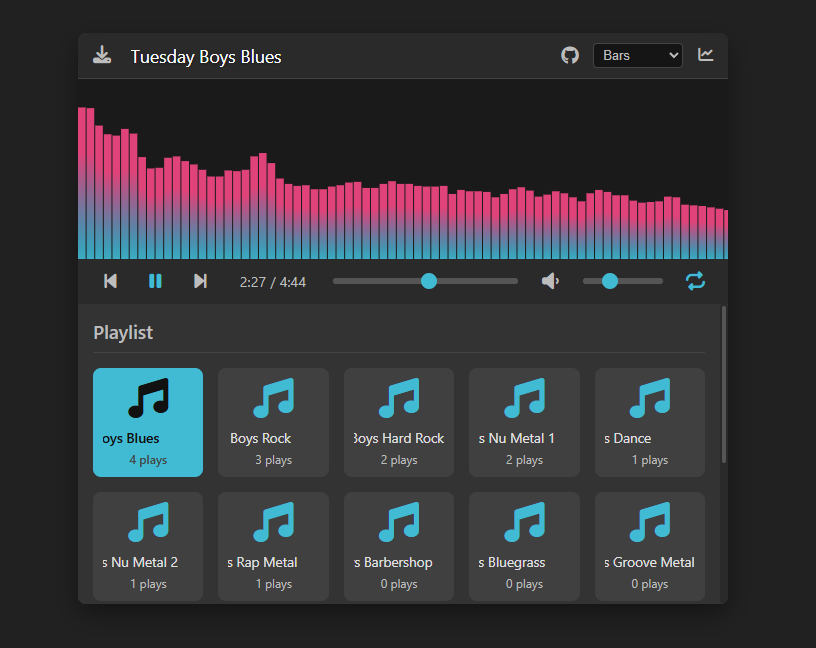

# JukeBox 🎵

[](https://opensource.org/licenses/MIT)
[]()
[](https://nodejs.org/)
[](https://lokijs.org/)

A sleek, web-based music player designed to dynamically load and play your local MP3 collection, featuring audio visualization, play/download count tracking, and usage statistics. Built with Node.js, Express, and LokiJS.


*(Screenshot of the running application)*

---

## ✨ Features

*   **Dynamic Playlist:** Automatically scans a local `music` folder on the server for `.mp3` files on startup.
*   **Play/Download Count Tracking:** Records plays (past 50%) and downloads in a local LokiJS database (`jukebox.db.json`).
*   **Sorted Playlist:** Displays the playlist sorted by play count (most played first), with secondary alphabetical sorting.
*   **Usage Statistics:** In-app modal shows total visits, detailed track plays/downloads, and daily activity charts (visits/plays/downloads over last 14 days).
*   **Sleek UI:** Modern interface with controls for play/pause, previous/next, seek, volume, and play mode (repeat all/one, shuffle).
*   **Audio Visualization:** Real-time canvas-based visualization with multiple styles (Bars, Blocks, Waveform).
*   **Grid Playlist Display:** Visually appealing grid layout for the playlist with icons and play counts.
*   **Scrolling Song Titles:** Long song titles automatically scroll horizontally when they exceed their container width, pausing on hover for easier reading.
*   **Persistent Settings:** Remembers user preferences (volume level, last played song, visualization style, play mode) using localStorage.
*   **Server-Side Logic:** Uses Node.js and Express to serve the application and handle API requests.
*   **Embedded DB:** Uses LokiJS (in-memory with file persistence) - no native dependencies required for the database.
*   **Debug Logging:** Configurable console logging for development and troubleshooting.

## 🎶 Music Credits & Licensing

The music files used in the `music/` directory for demonstration are **license-free**. They were generated using the AI music creation platform [Suno.ai](https://suno.com/@mikl0s) for my dad's MG car restoral group of retired car enthusiasts called Tuesday Boys.

## 💻 Tech Stack

*   **Backend:** Node.js, Express.js
*   **Database:** LokiJS (`lokijs` npm package)
*   **Frontend:** HTML5, CSS3, JavaScript (ES6+), Chart.js
*   **Package Manager:** pnpm (Recommended, but npm/yarn work too)
*   **Icons:** Font Awesome

## 🚀 Setup & Installation

1.  **Prerequisites:**
    *   [Node.js](https://nodejs.org/) (LTS version recommended) installed.
    *   [pnpm](https://pnpm.io/installation) installed globally (`npm install -g pnpm`).
    *   `git` installed.

2.  **Clone the Repository (Optional):**
    ```bash
    git clone <your-repo-url>
    cd <project-folder-name>
    ```

3.  **Install Dependencies:** Navigate to the project directory in your terminal and run:
    ```bash
    pnpm install
    ```

4.  **Configure Environment:**
    *   Copy or rename `.env.example` (if provided) or create a new file named `.env.local`.
    *   Edit `.env.local` to set your desired `PORT`, `MUSIC_FOLDER` (relative path), `DB_FILENAME`, `STATS_DAYS`, `DEBUG_LOGGING`, and `PLAYLIST_PREFIX_FILTER`. Example:
        ```dotenv
        PORT=4000
        MUSIC_FOLDER=music
        DB_FILENAME=jukebox.db.json
        STATS_DAYS=7
        DEBUG_LOGGING=true
        PLAYLIST_PREFIX_FILTER="^Tuesday\sBoys\s+"
        ```

5.  **Add Music:**
    *   Create the folder specified by `MUSIC_FOLDER` in `.env.local` (e.g., `music`).
    *   Place your `.mp3` files inside that folder.

## ▶️ Running the App

1.  **Start the Server:**
    ```bash
    pnpm start
    ```
    This reads `.env.local`, starts the Node.js server, and creates/updates the LokiJS database file specified by `DB_FILENAME`.

2.  **Access the Jukebox:** Open your web browser and navigate to:
    ```
    http://localhost:4000
    ```
    *(Replace `4000` if you changed the `PORT` in `.env.local`. Use your server IP if not running locally)*

The player should load, fetch the sorted playlist, track plays/downloads/visits, and display stats in the modal.

## ⚙️ Configuration

See the `.env.local` file for configurable options:

*   `PORT`: Network port the server listens on.
*   `MUSIC_FOLDER`: Path (relative to project root) containing `.mp3` files.
*   `DB_FILENAME`: Filename for the LokiJS database persistence.
*   `STATS_DAYS`: Number of past days to include in the stats graph (e.g., 7).
*   `DEBUG_LOGGING`: Enable/disable browser console debug logging (true/false).
*   `PLAYLIST_PREFIX_FILTER`: Optional regex pattern to remove from track titles (client-side display only).


## 📄 License

This project is licensed under the **MIT License**. See the [LICENSE](https://opensource.org/licenses/MIT) file or badge link for details.

---

## 🤖 Development Note

All the code in this project was generated by **Google Gemini 2.5 Pro Experimental 03-25** based directly on iterative prompts provided by the user. The entire functional application, including setup, server logic, dynamic playlist loading, database integration (LokiJS), stats tracking and display (including charts), client-side controls, and visualization, was produced through interactive prompting over ~2 hours. Due to using the free access in Google AI Studio I ran into the rate limit and had to use Windsurf for the final touches (~15 prompts, 30 minutes).
